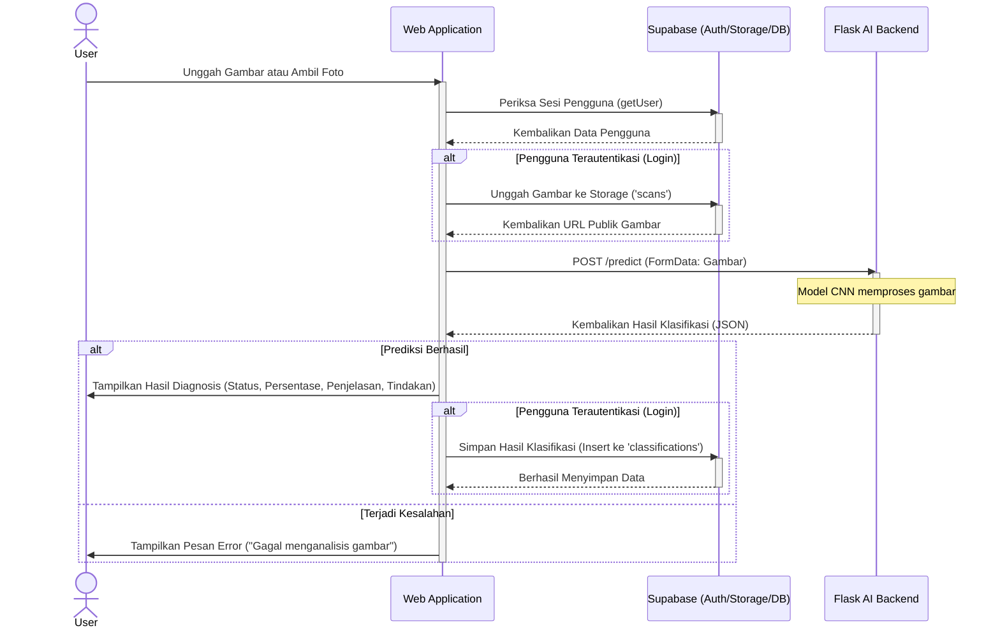

```mermaid
sequenceDiagram
    actor User
    participant Frontend as Web Application
    participant Supabase as Supabase (Auth/Storage/DB)
    participant Backend as Flask AI Backend

    User->>Frontend: Unggah Gambar atau Ambil Foto
    activate Frontend
    
    Frontend->>Supabase: Periksa Sesi Pengguna (getUser)
    activate Supabase
    Supabase-->>Frontend: Kembalikan Data Pengguna
    deactivate Supabase
    
    alt Pengguna Terautentikasi (Login)
        Frontend->>Supabase: Unggah Gambar ke Storage ('scans')
        activate Supabase
        Supabase-->>Frontend: Kembalikan URL Publik Gambar
        deactivate Supabase
    end

    Frontend->>Backend: POST /predict (FormData: Gambar)
    activate Backend
    Note over Backend: Model CNN memproses gambar
    Backend-->>Frontend: Kembalikan Hasil Klasifikasi (JSON)
    deactivate Backend

    alt Prediksi Berhasil
        Frontend->>User: Tampilkan Hasil Diagnosis (Status, Persentase, Penjelasan, Tindakan)
        
        alt Pengguna Terautentikasi (Login)
            Frontend->>Supabase: Simpan Hasil Klasifikasi (Insert ke 'classifications')
            activate Supabase
            Supabase-->>Frontend: Berhasil Menyimpan Data
            deactivate Supabase
        end
    else Terjadi Kesalahan
        Frontend->>User: Tampilkan Pesan Error ("Gagal menganalisis gambar")
    end
    deactivate Frontend
```
